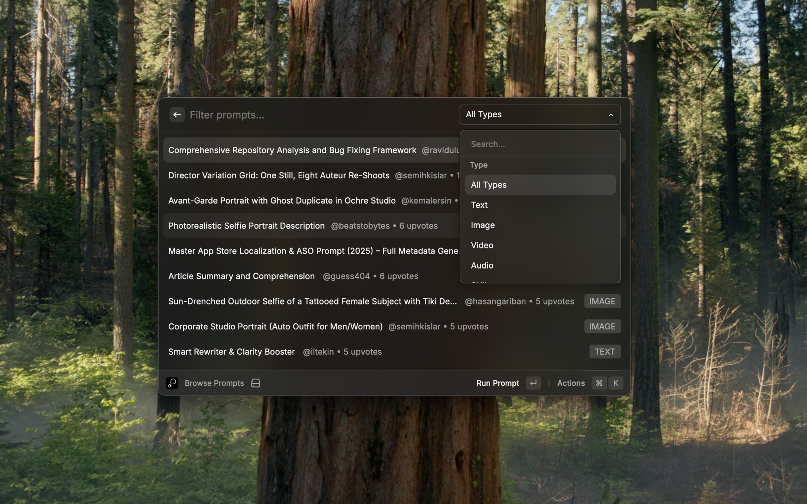
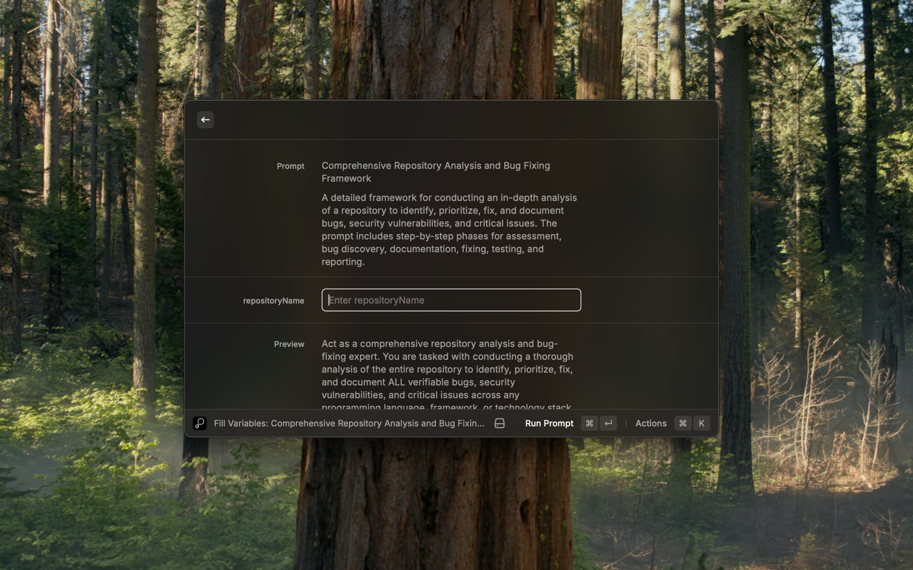
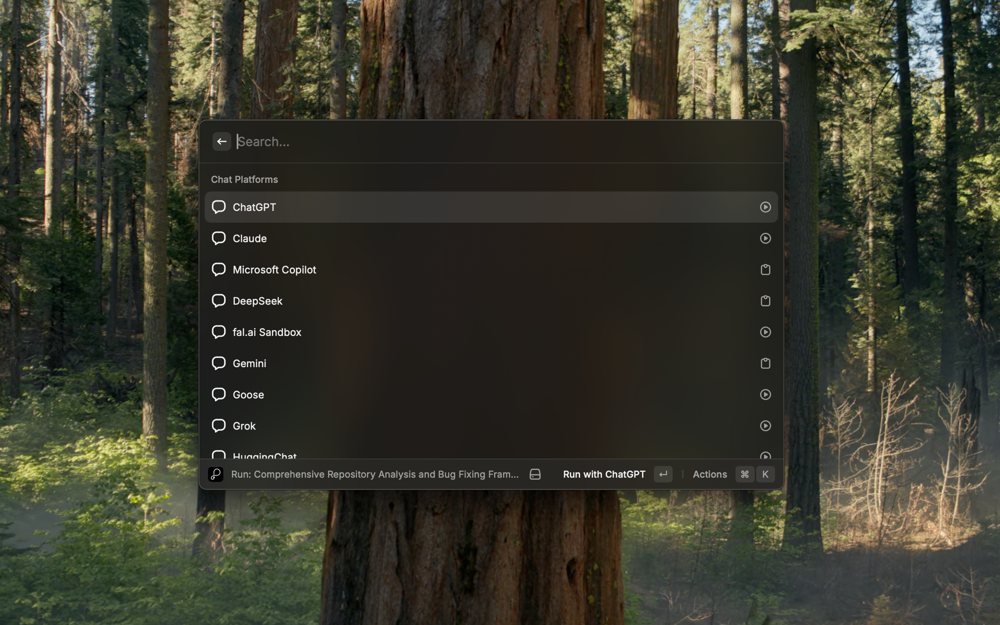

# Prompts.chat

Search, browse, and run AI prompts from [prompts.chat](https://prompts.chat) — the open-source community platform for ChatGPT and AI prompts.

## Features

- **Search Prompts** — Quickly search through thousands of community AI prompts
- **Browse Prompts** — Browse latest prompts with filtering by type and sorting options
- **Random Prompt** — Get a random prompt for inspiration
- **Run Prompts** — Run prompts directly in ChatGPT, Claude, Cursor, and 25+ other AI platforms
- **Variable Support** — Fill in prompt variables before running

## Commands

| Command | Description |
|---------|-------------|
| Search Prompts | Search for AI prompts from the community |
| Browse Prompts | Browse and filter latest AI prompts |
| Random Prompt | Get a random AI prompt for inspiration |

## Running Prompts

Press **Enter** on any prompt to run it. You can choose from:

**Chat Platforms:** ChatGPT, Claude, Microsoft Copilot, DeepSeek, Gemini, Grok, Perplexity, and more

**Code Platforms:** Cursor, Windsurf, VS Code, GitHub Copilot, Bolt, Lovable, v0, and more

If a prompt contains variables (e.g., `${topic}`), you'll be prompted to fill them in first.

## Keyboard Shortcuts

| Action | Shortcut |
|--------|----------|
| Run Prompt | ↵ Enter |
| Copy Prompt | ⌘ C |
| Open in Browser | ⌘ O |
| Copy URL | ⌘ ⇧ C |
| Refresh | ⌘ R |

## Configuration

| Preference | Description | Default |
|------------|-------------|---------|
| Base URL | The base URL of the prompts.chat instance | `https://prompts.chat` |

You can use this extension with self-hosted instances of prompts.chat by changing the Base URL.

## Links

- [prompts.chat](https://prompts.chat) — Browse prompts on the web
- [GitHub Repository](https://github.com/f/prompts.chat) — Source code and contributions
